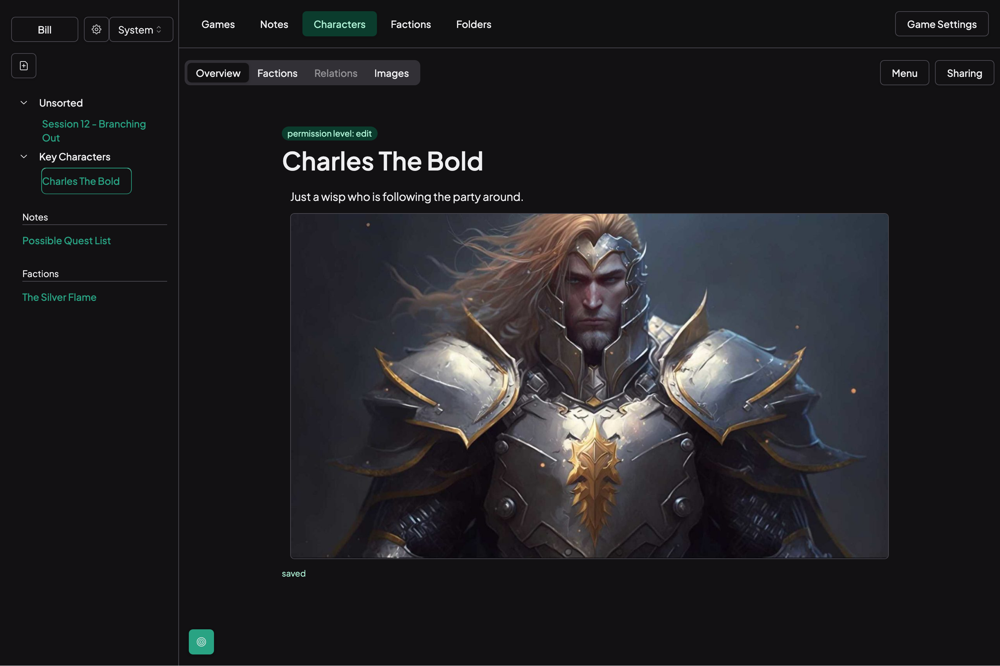

Game Master is a server-centered note taking app, designed for DMs and TTRPG players.

## Features

- **Rich text editing experience** with full markdown support, inline images, and deep links to other notes
- **Opinionated note structure** designed to help developers plan games, and have quick access to their most important notes
- **Multiple view options** including split view, floating note windows, and tabs

## Technology Used

### back-end

I used Elixir and Phoenix for the back end application, due to its strong concurrence capabilities, excellent database support, and a convention over configuration approach to common back-end problems.

### Supabase

Supabase is utilised for authentication and database management. It offers real-time subscriptions and auto-generated APIs, providing the versatility of PostgreSQL while replicating some Firebase features.

### Remix and React

The UI, routing, and data loading are built with Remix and React. Remix enhances user experience with server-side rendering on initial load and efficient data fetching for client-side navigation.

### DrizzleORM

DrizzleORM handles the app's Object-Relational Mapping (ORM). It simplifies data operations like inserting, updating, or querying data, and provides robust tools for managing database schema migrations.

### Radix Components

The app uses Radix-UI for low-level, accessible, and unstyled UI components, offering a developer-friendly declarative API. The UI design is influenced by Shadcn styled-components, promoting a modern and minimalist aesthetic.

### TailwindCSS

Tailwind CSS is used for atomic styling with utility classes. It integrates well with Radix and can be combined with conditional class libraries like clsx and class-variance-authority to rapidly build expressive design systems.

### [Fly.io](http://Fly.io)

The application is deployed on [Fly.io](http://Fly.io), chosen for its easy deployment, scalability, and serverful runtime, which fully utilises Node.js's capabilities.

### Cloudflare Workers

Serverless functions are employed for asynchronous tasks. A custom API accessed via a Cloudflare Worker offloads large writes to the database, ensuring smooth user flow when saving game data.
