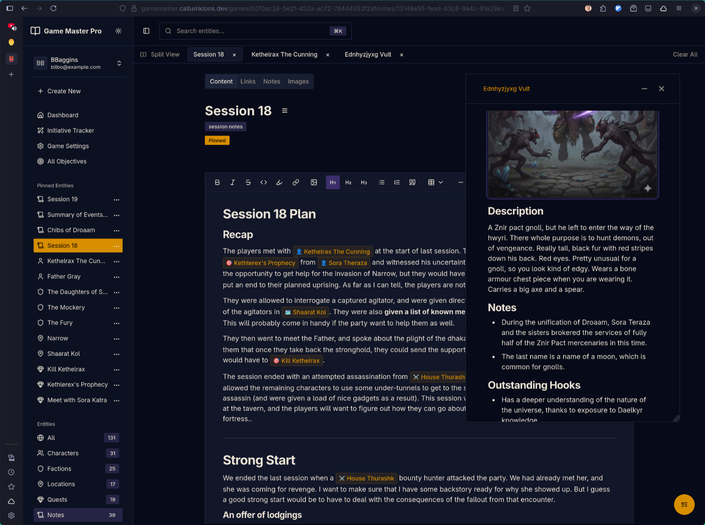
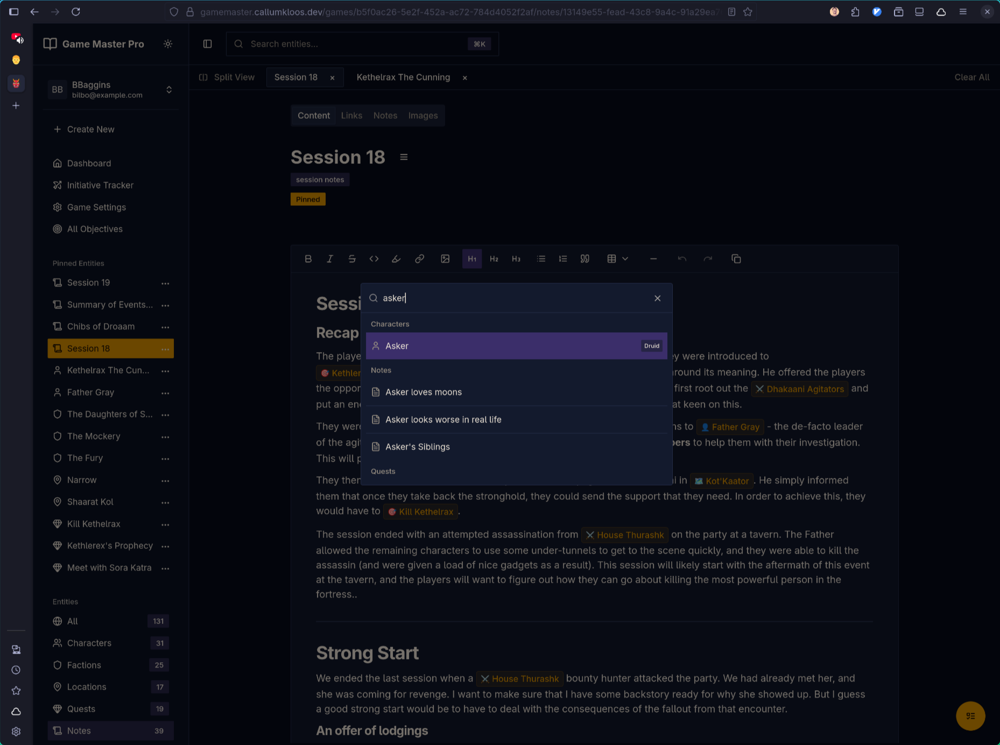
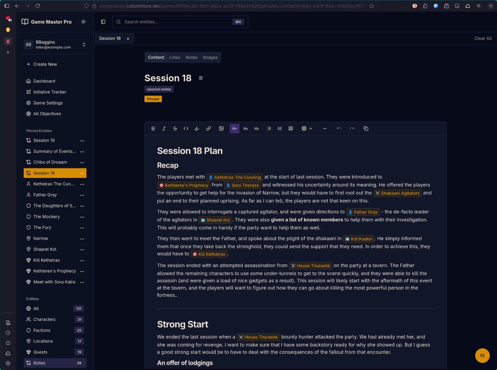
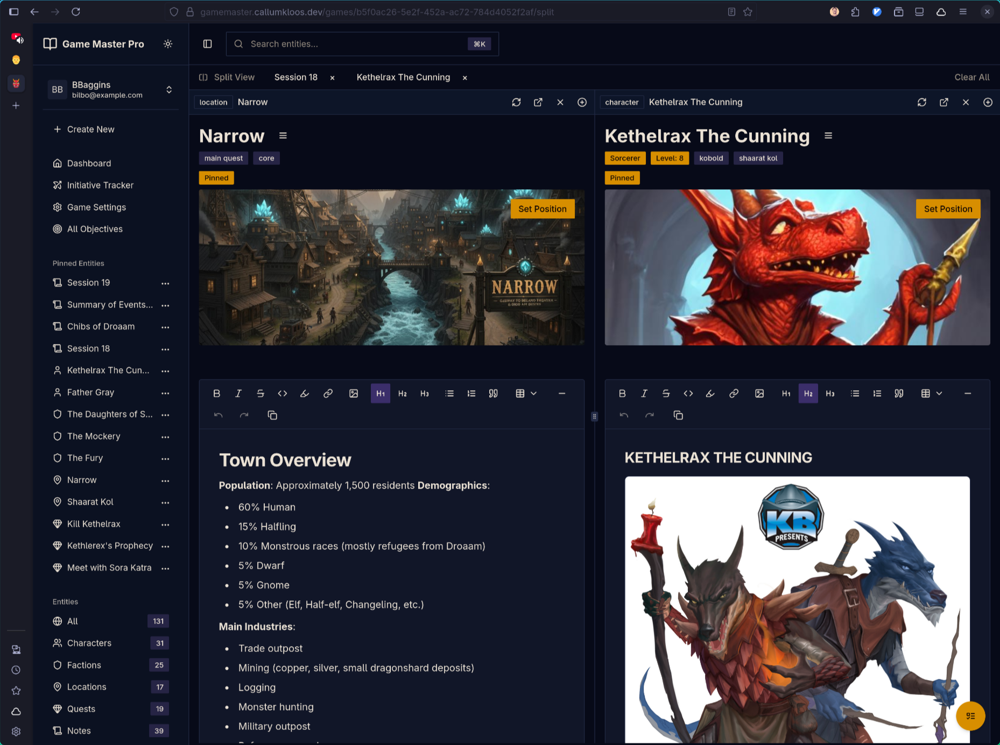
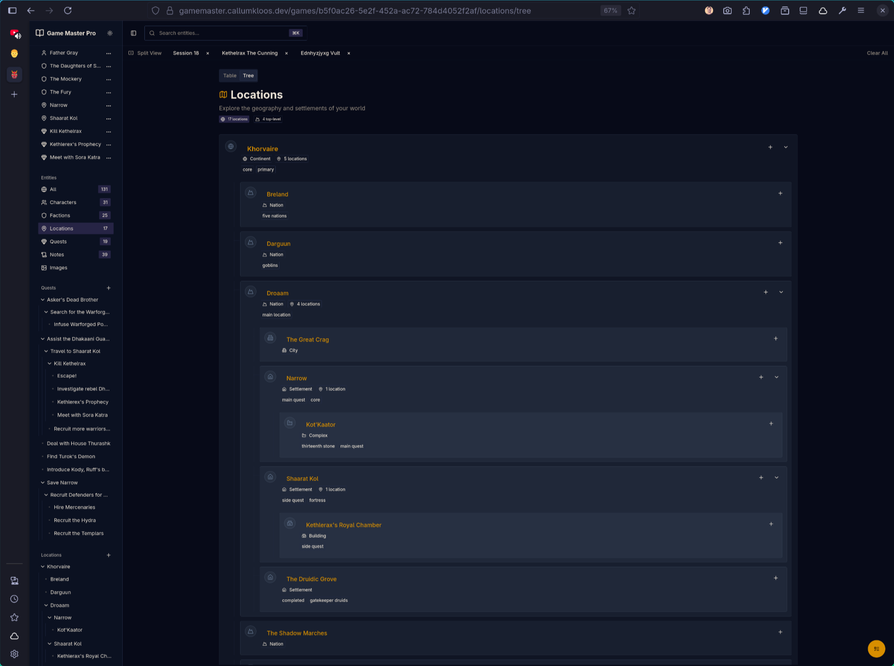
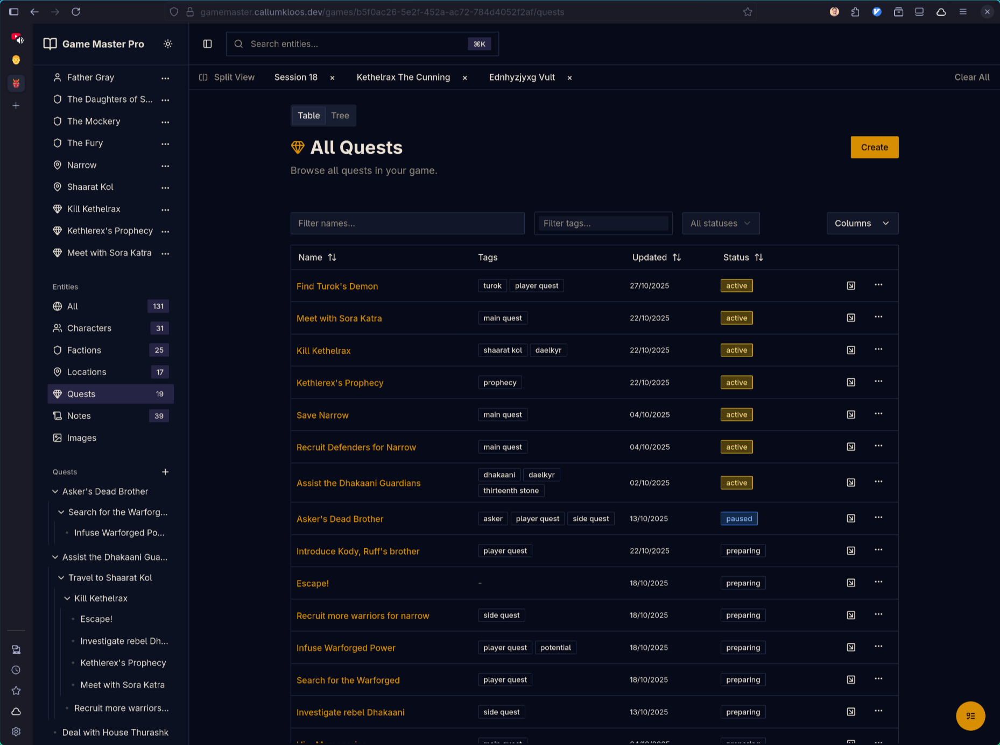

> Game Master is a campaign management tool for tabletop RPG game masters. It provides an opinionated workflow for organising world-building, characters, and session planning—removing the organisational burden so users can focus on creative storytelling.

## The Problem

Generic note-taking tools like Notion and Obsidian are powerful but not tailored to TTRPG campaign management. New users spend hours researching optimal workflows and structures rather than writing content. Every game master reinvents the same organisational wheel.

## The Solution

Game Master codifies proven campaign organisation patterns into an opinionated structure (Notes, Characters, Factions, Locations, Quests). It combines the modern feel of Notion with purpose-built features for gameplay: command palette navigation, split views for active sessions, and full mobile support for in-person play.

Built with Elixir/Phoenix and React, leveraging Elixir's batteries-included philosophy to focus on functionality rather than reinventing infrastructure. Currently in alpha testing with close friends.

## Key Features

**Opinionated Workflow**: Pre-defined entity types (Notes, Characters, Factions, Locations, Quests) guide users towards proven organisation patterns without sacrificing flexibility.

**Built for Active Play**: Deeply linked notes, pinned references, command palette for keyboard navigation, popout windows, and tab-based browsing enable swift access to information during live sessions.

**WYSIWYG Editing**: Tiptap-powered editor with custom node rendering and inline image uploads.

**Discovery & Organisation**: Tree structures, data tables with search and tag filtering, and pre-defined entity relationships.

**Mobile Support**: Full mobile experience for in-person gameplay.

## Technical Implementation

**Backend**: Elixir/Phoenix leveraging the BEAM's concurrency model, with OpenAPI specification for type-safe frontend integration. PostgreSQL database managed through Ecto.

**Frontend**: React SPA with selective SSR using TanStack Router/Start. TanStack Query (auto-generated from OpenAPI) handles data fetching and caching. Zustand manages global UI state for windows, tabs, and sheets.

## Key Technical Challenge: Data Fetching & Caching

Initial implementation used a brute-force approach to data fetching, leading to performance issues. Through iterative optimisation, implemented strategic caching layers and query invalidation patterns using TanStack Query. Future plans include exploring local-first architecture for offline support and improved responsiveness.

## What I Learnt

**Complex State Management**: Managing UI state across popout windows, tabs, and deeply linked entities required careful separation of concerns. TanStack Query handles server state with caching and invalidation strategies, Zustand manages global UI state (windows, tabs, sheets), and local component state handles ephemeral interactions. Understanding when to use each approach—and avoiding mixing responsibilities—was critical for maintainability and performance.
